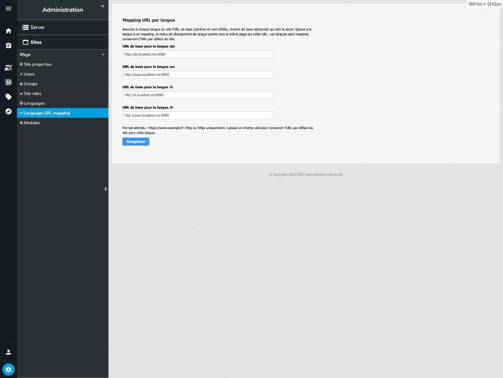

# Multi Domain Language Switch

Jahia 8.2 module with one job: a language switch menu where each site language can
live on its own domain. Switching language keeps the current page but changes the
host, for example `fr` on `https://www.example.fr`, `de` on `https://www.example.de`
and `en` on `https://www.example.com`.

## What's in the module

The droppable component `lsm:domaineSwitchLanguage` renders the menu: a `<nav>`
with one link per site language. Labels are endonyms ("Français", "Deutsch"), each
link has `lang` and `hreflang` in BCP 47 form, and the current language gets
`aria-current="page"` plus a bold/underline style.

The mapping is configured in a site settings panel (*Administration → Sites → your
site → Language URL mapping*), one URL field per site language. The panel follows
the permalink-generator pattern and saves through the `saveLanguageUrls` action
onto the site node itself: mixin `lsm:languageUrlSettings`, multi-valued property
`lsm:languageUrls` with entries like `fr=https://www.example.fr`. The field list is
built from the site's languages, so adding a language to the site adds a field.
Only http(s) URLs are accepted, checked on save and again at render time. Saving
shows a toast (screen-reader friendly: it is a `role="status"` live region). The
permission `siteAdminLanguageUrlMapping` (under `site-admin`) guards both the
panel and the action.

UI texts (component name, menu label, panel) ship in Jahia's six standard UI
languages: English, French, German, Italian, Portuguese and Spanish.

Two render filters do the actual multi-domain work, both live mode only:

`LanguageLinkRewriteFilter` (priority 5) rewrites the menu links so each one
carries the full hostname registered for its language. It runs as an outer filter,
after Jahia's SEO URL rewriting and outside the fragment cache, and only touches
anchors with the `lsm-item` class.

`LanguageDomainRedirectFilter` (priority 13) sends a 302 when someone requests a
page in a language mapped to a different host. A visitor who opens
`https://www.example.com/fr/page.html` ends up on
`https://www.example.fr/fr/page.html`. This also keeps one canonical domain per
language for direct links and search engines.

## Why filters and not the link tag

We tried putting the mapped host directly in the generated link. It does not
survive rendering: Jahia's outbound SEO rewriting normalizes any absolute URL
whose host belongs to the current site back to a local URL, and the pretty form of
the link (`/fr/page.html`, vanity URLs included) only exists after that rewriting
has run. The only reliable place to inject the host is after the SEO step, which
is exactly where `LanguageLinkRewriteFilter` sits. The JSP tag
(`lsm:switchToLanguageUrlLink`) therefore emits a standard Jahia switch link to
the main resource and stays out of the domain business.

## Worked example

A site with four languages (fr as default, en, de, it), each mapped to its own
host in the settings panel:

| Language | Base URL |
|----------|----------|
| de | `http://de.localtest.me:8080` |
| en | `http://www.localtest.me:8080` |
| it | `http://it.localtest.me:8080` |
| fr | `http://www.localtest.me:8080` |

Note that `fr` and `en` deliberately share the same domain (`www.localtest.me`):
the mapping does not have to be one domain per language. Several languages can
live on one host, where the language path segment tells them apart, while others
get a dedicated domain.



On the live French home page (`http://www.localtest.me:8080/home.html`, no `/fr/`
prefix since French is the default language), the component renders:


```html
<nav class="lsm-language-menu" aria-label="Changer de langue">
    <ul>
        <li><a class="lsm-item" href="http://de.localtest.me:8080/de/home.html" lang="de" hreflang="de">Deutsch</a></li>
        <li><a class="lsm-item" href="http://www.localtest.me:8080/en/home.html" lang="en" hreflang="en">English</a></li>
        <li><a class="lsm-item lsm-current" href="http://www.localtest.me:8080/home.html" lang="fr" hreflang="fr" aria-current="page">français</a></li>
        <li><a class="lsm-item" href="http://it.localtest.me:8080/it/home.html" lang="it" hreflang="it">italiano</a></li>
    </ul>
</nav>
```

Each link carries the host registered for its language. German and Italian point
to their dedicated domains; English and French share `www` and are distinguished
by the language path segment (the default language has none). The `nav` label
follows the page language ("Changer de langue" here, from the fr resource bundle).

### With vanity URLs

Vanity URLs flow straight into the menu, because the link rewrite filter runs
after Jahia's SEO URL rewriting. With a vanity URL per language on the home page
(`/accueil`, `/home`, `/startseite`, `/pagina-iniziale`), the same component
renders (here on the Italian page):

```html
<nav class="lsm-language-menu" aria-label="Changer de langue">
    <ul>
        <li><a class="lsm-item" href="http://de.localtest.me:8080/startseite" lang="de" hreflang="de">Deutsch</a></li>
        <li><a class="lsm-item" href="http://www.localtest.me:8080/home" lang="en" hreflang="en">English</a></li>
        <li><a class="lsm-item" href="http://www.localtest.me:8080/accueil" lang="fr" hreflang="fr">français</a></li>
        <li><a class="lsm-item lsm-current" href="http://it.localtest.me:8080/pagina-iniziale" lang="it" hreflang="it" aria-current="page">italiano</a></li>
    </ul>
</nav>
```

When a page has no vanity URL for a language, the menu falls back to the full
standard URL for that language, language segment included, as in the previous
example (`http://de.localtest.me:8080/de/home.html`).

## Live mode only

Both filters skip edit and preview modes on purpose. Editors keep plain local
links and are never redirected to another domain, which would throw them out of
their editing session. Test the multi-domain behavior on the live site.

## Build and deploy

```bash
mvn clean install
# copy target/multi-domain-language-switch-*.jar to digital-factory-data/modules/
# or: mvn clean install jahia:deploy -Djahia.deploy.targetContainerName=<docker-container>
```

Enable the module on the site. Site administrators can use the settings panel out
of the box; grant `siteAdminLanguageUrlMapping` to anyone else who needs it.

## Testing the setup

Using the worked example above:

1. Open the site on the domain mapped to the default language:
   `http://www.localtest.me:8080/`.
2. Check the menu links: they carry the mapped domains (DE on
   `http://de.localtest.me:8080/...`, IT on `http://it.localtest.me:8080/...`,
   EN and FR on `http://www.localtest.me:8080/...`).
3. Click a language mapped to another domain. You land on the same page on that
   domain and can switch back.
4. Open a page directly on the wrong domain for its language, for example
   `http://www.localtest.me:8080/de/home.html`. You get a 302 to
   `http://de.localtest.me:8080/de/home.html`.

## Good to know

- Every mapped hostname must be declared on the site, as its server name or in
  its server name aliases (`j:serverNameAliases`, editable in the site
  properties), and must of course resolve to the Jahia instance (DNS or front
  proxy). A hostname unknown to Jahia gives a 404 on short URLs.
- In live, a language only shows up in the menu if the current page has a
  published translation, and the site's languages must be active in live.
- Leave a mapping field empty and that language keeps the default site URL.
- The menu fragment is cached per page (`cache.mainResource=true`); the filters
  run outside the cache, so mapping changes apply on the next request without a
  cache flush.
- The panel saves with XMLHttpRequest plus the CSRFGuard script (`/CsrfServlet`).
  A plain `fetch` would be rejected by Jahia's CSRF protection.
- `Jahia-Source-Folders` is set in the pom for deploy-free coding. Remove it for
  release builds.
