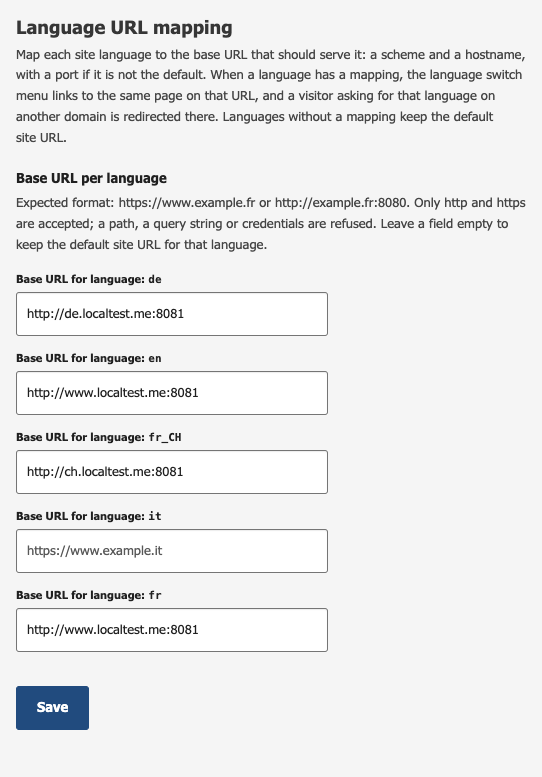
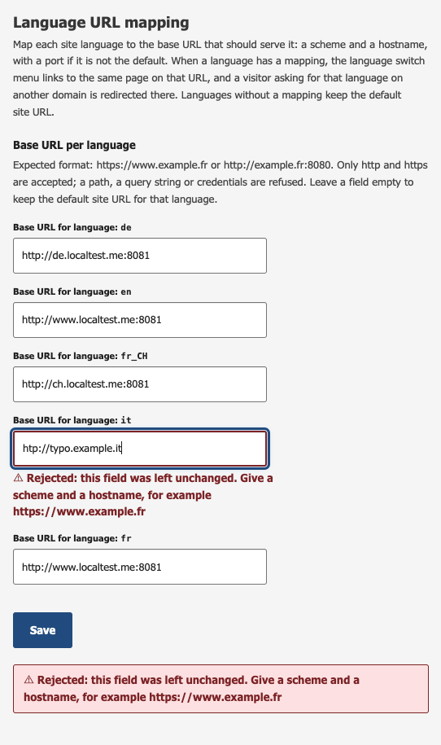
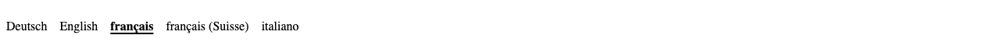
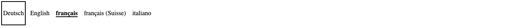

# Multi Domain Language Switch

Community module for Jahia 8.2 that binds each language of a site to its own
domain, and makes the language switch menu move visitors between those domains:

| Language | Domain |
|----------|--------|
| `fr` | `https://www.example.fr` |
| `de` | `https://www.example.de` |
| `en` | `https://www.example.com` |

Switching language keeps the visitor on the same page and changes the host.
Requesting a page in a language bound to another domain redirects there.

| | |
|---|---|
| **Requires** | Jahia 8.2 · optional: `site-settings-seo` for the `hreflang` and canonical rewriting |
| **Configured in** | Administration → Sites → *Language URL mapping* |
| **Affects** | live mode only — edit and preview are untouched by design |
| **Licence** | MIT |

### Where to read what

| If you want to | Read |
|---|---|
| Understand what this solves and why Jahia needs it | this file, starting at [Why this module exists](#why-this-module-exists) |
| Use the component from your own module, or restyle it | **[INTEGRATION.md](INTEGRATION.md)** |
| Answer a setup question | **[FAQ.md](FAQ.md)** — mapping format, ports, CDN, SEO, local testing |
| Run or extend the test suites | [Tests](#tests) here, then **[tests/README.md](tests/README.md)** |
| Know the design and accessibility commitments | **[PRODUCT.md](PRODUCT.md)** |

## Why this module exists

**Jahia does not support a language-per-domain mapping natively.** Its
multi-domain support works at the *site* level: the server name and its aliases
(`j:serverNameAliases`) identify which site a request belongs to, and once the
site is resolved, the language is carried by the URL *path* — the language
segment (`/fr/page.html`) or a vanity URL. Nothing in that chain ties a language
to a host.

The core language switcher follows the same model. `DisplayLanguageSwitchLinkTag`
builds its links from `URLGenerator.getLanguage(languageCode)`, which assembles a
path — context, servlet path, workspace, language code, node path — and delegates
the rest to the URL rewriting engine. No hostname is ever involved, so no
configuration of that component produces a per-language domain.

Two things follow, and both are what this module supplies:

1. **The switch menu cannot send a visitor to another domain.** It emits a local
   link for every language, so a language living on a dedicated domain is
   unreachable from the menu. This module's menu emits a link per language
   carrying that language's registered host.
2. **Nothing enforces a language's domain.** A page in a given language answers
   on any hostname declared on the site, so the same content is served under
   several domains with no preferred entry point. This module redirects a request
   to the domain bound to the language of the requested page.

Doing it in the front proxy instead (rewrite `/` or `/de/*` on the German domain)
handles the entry point, but not the menu: the proxy has no knowledge of site
languages, and cannot tell which of the links in a rendered page should point
elsewhere. The two halves belong together, which is why they sit in one module.

### When you do not need this

- **One domain, several languages** — the stock language switcher already does
  the job. Language lives in the path, which is Jahia's native model.
- **One domain per site, one language per site** — that is standard Jahia
  multi-site: one site per language, each with its own server name.
- **A language must simply be reachable under a prettier URL** — vanity URLs
  cover that, without any module.

This module addresses the remaining case: *one* site, several languages, and
domains that differ per language. Note that the mapping is not required to be
one-to-one — several languages can share a host while others get a dedicated one
(see the [worked example](#worked-example)).

## What's in the module

The droppable component `lsm:domaineSwitchLanguage` renders the menu: a `<nav>`
with one link per site language. Labels are endonyms ("Français", "Deutsch"), each
link has `lang` and `hreflang` in BCP 47 form, and the current language gets
`aria-current="page"` plus a bold/underline style.

The mapping is configured in a site settings panel (*Administration → Sites → your
site → Language URL mapping*), one URL field per site language. The panel follows
the permalink-generator pattern and saves through the `saveLanguageUrls` action
onto the site node itself: mixin `lsm:languageUrlSettings`, multi-valued property
`lsm:languageUrls` with entries like `fr=https://www.example.fr`. The field list is
built from the site's languages, so adding a language to the site adds a field.
Only http(s) URLs are accepted, checked on save and again at render time. Enter a
scheme and a host, optionally with a port (`https://ch.example.com`,
`http://it.localtest.me:8080`) — a path is not supported: both filters compare and
rewrite on host and port only, so any path in the value is silently dropped.
Language keys are Java locale form (`fr`, `fr_CH`), matching
`resource.getLocale().toString()`. Saving shows a toast (screen-reader friendly:
it is a `role="status"` live region). The permission
`siteAdminLanguageUrlMapping` (under `site-admin`) guards both the panel and the
action.

UI texts (component name, menu label, panel) ship in Jahia's six standard UI
languages: English, French, German, Italian, Portuguese and Spanish.

Two render filters do the actual multi-domain work, both live mode only:

`LanguageLinkRewriteFilter` (priority 5) puts the registered hostname into every
language-specific URL of the rendered page: the menu links (anchors with the
`lsm-item` class, keyed on their `lang` attribute), the
`<link rel="alternate" hreflang="…">` elements and the `<link rel="canonical">`
element (see [SEO head elements](#seo-head-elements)). It runs as an outer
filter, after Jahia's SEO URL rewriting, and outside the fragment cache.

`LanguageDomainRedirectFilter` (priority 13) sends a 302 when someone requests a
page in a language mapped to a different host. A visitor who opens
`https://www.example.com/fr/page.html` ends up on
`https://www.example.fr/fr/page.html`. This gives every language one entry
domain, whichever host the incoming link used.

It decides on the *resolved locale* of the rendered resource, never on the shape
of the incoming URL, so it works the same for standard URLs and for vanity URLs
(see [Vanity URLs and the redirect](#vanity-urls-and-the-redirect)). Two
deliberate limits: it only applies to page-level main resources, so a vanity URL
pointing at a non-page content node triggers no redirect; and it answers 302, not
301, so it does not by itself declare a canonical domain to search engines. Add
`<link rel="canonical">` (or switch the status code) if that is what you are
after.

## Why render filters and not the link tag

We tried putting the mapped host directly in the generated link. It does not
survive rendering: Jahia's outbound SEO rewriting normalizes any absolute URL
whose host belongs to the current site back to a local URL, and the pretty form of
the link (`/fr/page.html`, vanity URLs included) only exists after that rewriting
has run. The only reliable place to inject the host is after the SEO step, which
is exactly where `LanguageLinkRewriteFilter` sits. The JSP tag
(`lsm:switchToLanguageUrlLink`) therefore emits a standard Jahia switch link to
the main resource and stays out of the domain business.

## Worked example

A site with four languages (fr as default, en, de, it), each mapped to its own
host in the settings panel:

| Language | Base URL |
|----------|----------|
| de | `http://de.localtest.me:8080` |
| en | `http://www.localtest.me:8080` |
| it | `http://it.localtest.me:8080` |
| fr | `http://www.localtest.me:8080` |

Note that `fr` and `en` deliberately share the same domain (`www.localtest.me`):
the mapping does not have to be one domain per language. Several languages can
live on one host, where the language path segment tells them apart, while others
get a dedicated domain.



A refused value is reported on the field it came from, and the field keeps the
mapping it already had rather than losing it:



On the live French home page (`http://www.localtest.me:8080/home.html`, no `/fr/`
prefix since French is the default language), the component renders:



The module imposes no colour and no font, so the menu inherits both from the
site. What it does guarantee is the state and the operability — here the focus
indicator, drawn in the inherited text colour so it works on any background:



```html
<nav class="lsm-language-menu" aria-label="Changer de langue">
    <ul>
        <li><a class="lsm-item" href="http://de.localtest.me:8080/de/home.html" lang="de" hreflang="de">Deutsch</a></li>
        <li><a class="lsm-item" href="http://www.localtest.me:8080/en/home.html" lang="en" hreflang="en">English</a></li>
        <li><a class="lsm-item lsm-current" href="http://www.localtest.me:8080/home.html" lang="fr" hreflang="fr" aria-current="page">français</a></li>
        <li><a class="lsm-item" href="http://it.localtest.me:8080/it/home.html" lang="it" hreflang="it">italiano</a></li>
    </ul>
</nav>
```

Each link carries the host registered for its language. German and Italian point
to their dedicated domains; English and French share `www` and are distinguished
by the language path segment (the default language has none). The `nav` label
follows the page language ("Changer de langue" here, from the fr resource bundle).

### With vanity URLs

Vanity URLs flow straight into the menu. Two things make that work, and both are
needed: the JSP tag routes the link it generates through `response.encodeURL()`,
which is what actually triggers Jahia's outbound rewriting (without it the raw
`/cms/render/live/...` path is printed as-is, vanity URL or not), and the link
rewrite filter then runs *after* that rewriting, so it prefixes the host onto the
already-pretty URL instead of a technical path. With a vanity URL per language on
the home page
(`/accueil`, `/home`, `/startseite`, `/pagina-iniziale`), the same component
renders (here on the Italian page):

```html
<nav class="lsm-language-menu" aria-label="Changer de langue">
    <ul>
        <li><a class="lsm-item" href="http://de.localtest.me:8080/startseite" lang="de" hreflang="de">Deutsch</a></li>
        <li><a class="lsm-item" href="http://www.localtest.me:8080/home" lang="en" hreflang="en">English</a></li>
        <li><a class="lsm-item" href="http://www.localtest.me:8080/accueil" lang="fr" hreflang="fr">français</a></li>
        <li><a class="lsm-item lsm-current" href="http://it.localtest.me:8080/pagina-iniziale" lang="it" hreflang="it" aria-current="page">italiano</a></li>
    </ul>
</nav>
```

When a page has no vanity URL for a language, the menu falls back to the full
standard URL for that language, language segment included, as in the previous
example (`http://de.localtest.me:8080/de/home.html`).

### Vanity URLs and the redirect

A vanity URL requested on the wrong domain for its language **is** redirected,
and **keeps its vanity form**. Take a site with `fr_CH` mapped to
`https://ch-preprod.example.com` and a vanity URL `/accueil-ch` on the Swiss
French home page. Opening it on the French domain:

```
GET https://fr-preprod.example.com/accueil-ch
→ 302 Location: https://ch-preprod.example.com/accueil-ch
```

The chain, in order:

1. Jahia's inbound rewriting resolves the vanity URL and forwards internally to
   `/cms/render/live/fr_CH/sites/goyer/Home.html`.
2. `LanguageDomainRedirectFilter` runs after that forward, so
   `resource.getLocale()` is already `fr_CH` — the filter never parses the URL,
   which is why the vanity form is irrelevant to its decision.
3. The mapped host for `fr_CH` differs from the request's host, so it redirects.
4. For the `Location` header it reads the `javax.servlet.forward.request_uri`
   request attribute, which holds the URI *as the client asked for it* — the
   vanity URL. Using `getRequestURI()` would return the forwarded
   `/cms/render/...` path instead and destroy the vanity URL on every redirect.

The visitor therefore lands on the vanity URL on the right domain, in one hop.

One requirement worth repeating here: the "wrong" hostname must itself be
declared on the site (server name or `j:serverNameAliases`). If Jahia does not
know the host, step 1 fails with a 404 and the filter is never reached.

## SEO head elements

A multi-domain multilingual site needs its `hreflang` alternates and its
canonical link to carry the right domain per language, otherwise search engines
get told that every language lives on the host that happened to serve the page.

Jahia's **`site-settings-seo`** module already generates those elements — its
`SeoUrlFilter` (priority 16.2) inserts them into the `<head>`:

```html
<link rel="canonical" href="…" />
<link rel="alternate" hreflang="…" href="…" />
```

It builds each `href` from `URLGenerator.getServer()`, so they all carry the host
serving the current request. This module rewrites them:

- **each `alternate`** gets the host mapped to its own `hreflang`;
- **the `canonical`** gets the host mapped to the locale of the rendered page.

```html
<!-- as generated by site-settings-seo, on the .com host -->
<link rel="canonical" href="https://www.example.com/fr_CH/page.html" />
<link rel="alternate" hreflang="de" href="https://www.example.com/de/page.html" />
<link rel="alternate" hreflang="fr-CH" href="https://www.example.com/fr_CH/page.html" />

<!-- after this module -->
<link rel="canonical" href="https://ch.example.com/fr_CH/page.html" />
<link rel="alternate" hreflang="de" href="https://www.example.de/de/page.html" />
<link rel="alternate" hreflang="fr-CH" href="https://ch.example.com/fr_CH/page.html" />
```

No ordering configuration is needed. `execute()` runs in *decreasing* priority
order in Jahia's render chain, so this filter at priority 5 runs after
`SeoUrlFilter` at 16.2 and sees its output. Nothing declares a dependency on
`site-settings-seo` either: if it is not deployed, there are no such elements and
those two passes find nothing.

Three details worth knowing:

- A language with no mapping is left untouched, so its alternate keeps the
  default host. Same for a `hreflang` value that matches no site language.
- `hreflang` is emitted in BCP 47 form (`fr-CH`) while mapping keys are in Java
  form (`fr_CH`). The lookup converts, so both forms work here.
- If the site property `sitemapIndexURL` is set, `site-settings-seo` already uses
  it as the host for these elements, for all languages at once. This module
  overrides it per language: the more specific mapping wins.

These elements are only rewritten in live mode. `SeoUrlFilter` also runs in
preview, where they keep the local host — like every other link in preview.

## Live mode only

Both filters skip edit and preview modes on purpose. Editors keep plain local
links and are never redirected to another domain, which would throw them out of
their editing session. Test the multi-domain behavior on the live site.

## Build and deploy

```bash
mvn clean install
# copy target/multi-domain-language-switch-*.jar to digital-factory-data/modules/
# or: mvn clean install jahia:deploy -Djahia.deploy.targetContainerName=<docker-container>
```

Enable the module on the site. Site administrators can use the settings panel out
of the box; grant `siteAdminLanguageUrlMapping` to anyone else who needs it.

## Using it from your own module

To drop the component in your templates, render it with your own markup, or call
the switch link tag from one of your views, see
**[INTEGRATION.md](INTEGRATION.md)**. It covers the `jahia-depends` and
`Import-Package` declarations your module needs, a full example view, the markup
contract the rewrite filter depends on, and a troubleshooting table.

## FAQ

**[FAQ.md](FAQ.md)** answers the setup questions: several languages on one
domain, which port to put in the mapping (and the redirect loop you get wrong),
behavior behind a CDN, per-site scope, `hreflang` and canonical tags, testing
several domains locally.

## Tests

```bash
mvn test
```

94 JUnit 5 unit tests, no running Jahia needed — the Jahia collaborators
(`RenderContext`, `JCRSiteNode`, `Resource`, `PageContext`) are mocked.

| Class | Covers |
|---|---|
| `LanguageLinkRewriteFilterTest` | the three rewrite passes (menu anchors, `hreflang` alternates, canonical), the gates that keep the filter a no-op on unconfigured sites, mapping parsing and BCP 47 / Java form key lookup |
| `LanguageDomainRedirectFilterTest` | when a redirect is issued and where it points, vanity URL preservation through the forward attribute, query strings, port normalization, `fr` vs `fr_CH` |
| `SaveLanguageUrlsActionTest` | what is stored on the site node, scheme validation and rejection reporting, mixin handling, the JSON response |
| `SwitchToLanguageUrlTagTest` | the generated anchor, BCP 47 attributes, endonym labels, `aria-current`, XML escaping, and that the link goes through `encodeURL()` |
| `LanguageUrlMappingTest` | URL validation: what the mapping accepts, what it refuses (injection payloads, non-http schemes, credentials, hostless URLs), and the BCP 47 / Java form key lookup |

Two of these unit tests deliberately pin behavior that is a known hazard rather
than a feature, so a future change to it is a conscious one:

- `redirectLoopWhenSchemeIsHidden` — a proxy that hides the client scheme makes
  the filter redirect to the URL already requested. See the
  [FAQ](FAQ.md#which-port-do-i-put-in-the-mapping--the-front-end-one-or-tomcats).
- `bcp47KeyDoesNotMatch` — the redirect filter only accepts mapping keys in Java
  form, while the link rewrite filter accepts both.

### Integration tests

`tests/` holds a Cypress test bed running against a real Jahia, over a network of
four hostnames (`www`, `de`, `ch`, `it` on `localtest.me`) so the multi-domain
behavior is exercised for real: actual `Host` headers, actual 302 responses,
actual vanity URL resolution, and the real order of the render filters. Twelve
specs, from site provisioning to teardown, including `09-mapping-injection`
which asserts a mapping value can never break out of an `href` attribute.

Run against Jahia 8.2.3.2 in docker: **64 passing, 4 pending, 0 failing**. The
four pending tests all hit one blocker — CSRFGuard per-page tokens — documented
in [tests/README.md](tests/README.md), together with the traps this harness had
to work around.

## Testing the setup

Using the worked example above:

1. Open the site on the domain mapped to the default language:
   `http://www.localtest.me:8080/`.
2. Check the menu links: they carry the mapped domains (DE on
   `http://de.localtest.me:8080/...`, IT on `http://it.localtest.me:8080/...`,
   EN and FR on `http://www.localtest.me:8080/...`).
3. Click a language mapped to another domain. You land on the same page on that
   domain and can switch back.
4. Open a page directly on the wrong domain for its language, for example
   `http://www.localtest.me:8080/de/home.html`. You get a 302 to
   `http://de.localtest.me:8080/de/home.html`.
5. Same check with a vanity URL, which must survive the redirect. With
   `/startseite` as the German vanity URL of the home page:

   ```bash
   curl -sI http://www.localtest.me:8080/startseite | grep -i location
   # Location: http://de.localtest.me:8080/startseite
   ```

   A `Location` carrying `/cms/render/live/de/...` instead means the original
   request URI was lost — see [Vanity URLs and the
   redirect](#vanity-urls-and-the-redirect).

## Good to know

- Every mapped hostname must be declared on the site, as its server name or in
  its server name aliases (`j:serverNameAliases`, editable in the site
  properties), and must of course resolve to the Jahia instance (DNS or front
  proxy). A hostname unknown to Jahia gives a 404 on short URLs.
- In live, a language only shows up in the menu if the current page has a
  published translation, and the site's languages must be active in live.
- Leave a mapping field empty and that language keeps the default site URL.
- The menu fragment is cached per page (`cache.mainResource=true`); the filters
  run outside the cache, so mapping changes apply on the next request without a
  cache flush.
- The panel saves with XMLHttpRequest plus the CSRFGuard script (`/CsrfServlet`).
  A plain `fetch` would be rejected by Jahia's CSRF protection.
- `Jahia-Source-Folders` is empty by default: its value is an absolute path from
  the build machine, which has no place in a released manifest. Build with
  `-Pdev-sources` for deploy-free coding.
- Mapping values are parsed and rebuilt from their scheme, host and port, both on
  save and on read. That is a security boundary — see
  [the FAQ](FAQ.md#which-urls-does-the-mapping-accept-exactly).

## License

MIT — see [LICENSE.txt](LICENSE.txt).
